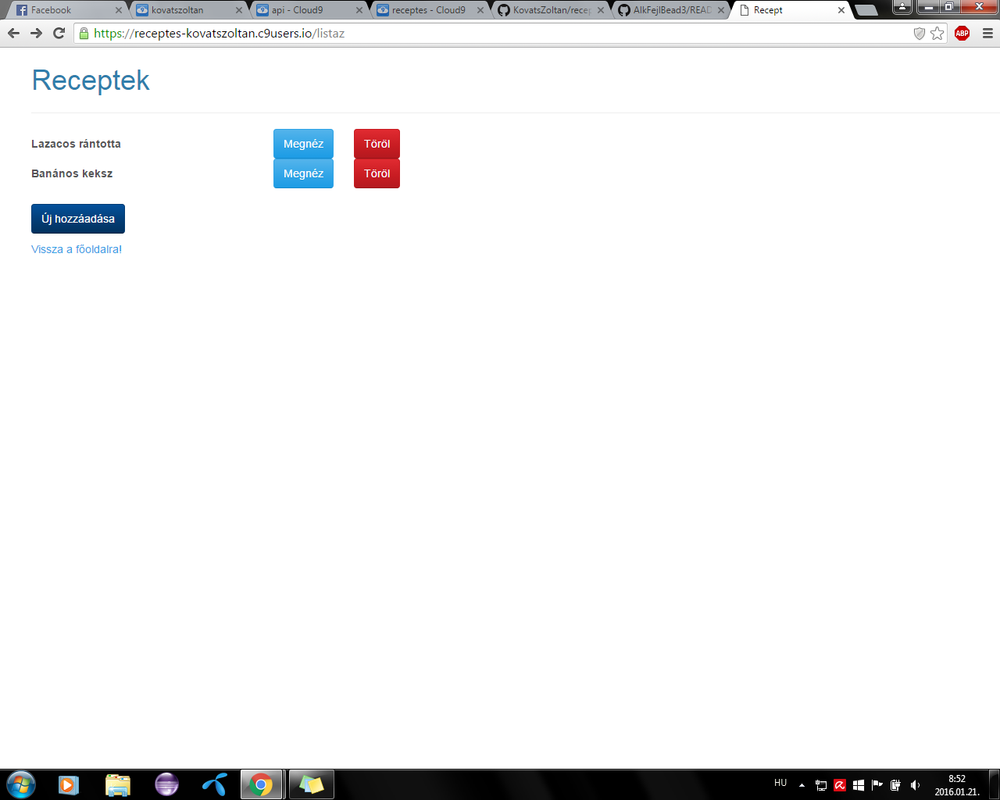
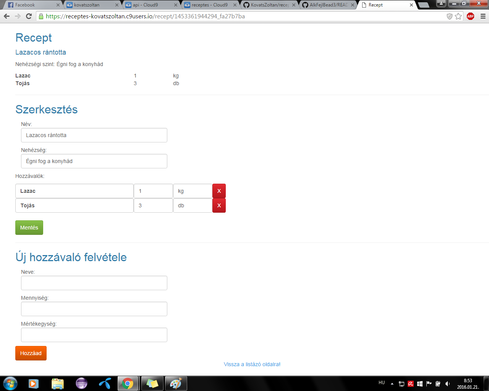
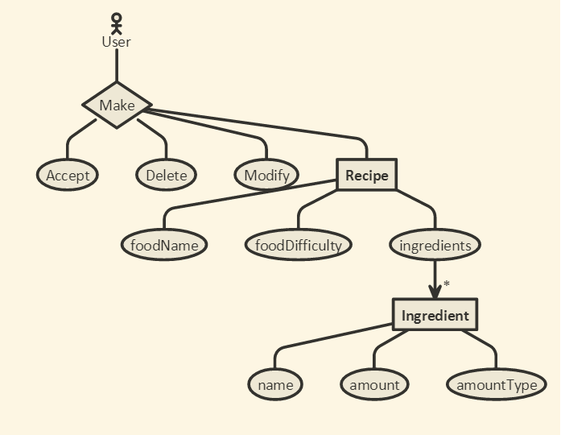
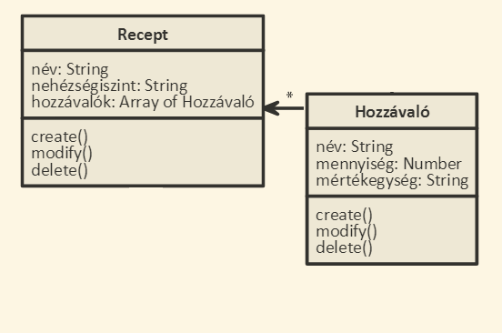

# Alkfejl beadandó

##Rövid ismertető
Egy webes vastagkliens, azaz egyoldalas alkalmazás készítése Ember.js segítségével az utolsó beadandó. 
Feladatot illetően lehet a szerveroldali alkalmazásnak egy kliensoldali változata, de másik feladat is választható. 
A feladatnak mininálisan tartalmaznia kell:

- legalább két modellt, egy-sok kapcsolatban
- legalább 1 űrlapot
- legalább 1 listázó oldalt
- legyen lehetőség új felvételére
- legyen lehetőség meglévő szerkesztésére
- legyen lehetőség meglévő törlésére
- REST API végpont kialakítása
- szerveroldali perzisztálás fájlba
A formai követelményeknek megfelelően kell elkészíteni, dokumentálni és közzétenni. 
Az órai gyakorlatnak megfelelően ez új workspace-ek létrehozását jelenti Cloud9 oldalon, és a Github-on is külön kódtárba dolgozzunk. 
A dokumentációval kapcsolatos elvárások a formai követelményeknél írtaknak megfelelő (minden kell). 
A Heroku-n való közzététel opcionális.

A receptek és hozzávalók feladatot választottam.
## Követelményanalízis

### Funkcionális elvárások
**A programnak tartalmaznia kell:**
- legalább két modellt, egy-sok kapcsolatban
- legalább 1 űrlapot
- legalább 1 listázó oldalt
- legyen lehetőség új felvételére
- legyen lehetőség meglévő szerkesztésére
- legyen lehetőség meglévő törlésére
- REST API végpont kialakítása

### Nem funkcionális elvárások
- szerveroldali perzisztálás fájlba

### Szerepkörök
- A honlap használatához regisztráció nem szükséges
- Az oldal látogatói létrehozhatnak, módosíthatnak és törölhetnek recepteket

Egy recept hozzávalójának hozzáadásának pontos menete:
- A felhasználó az üdvözlő oldalon van (index)
- Itt a receptek listázása linkre kattintva átkerül a "listaz" oldalra
- Ha meglévő recepthez akar hozzávalót adni, akkor a recept neve melletti "Megnéz" gombra kattintva tudja
- Ha új recepthez akar hozzáadni, akkor előbb létrehozza az "Új hozzáadása" gombbal, majd szintén a "Megnéz"-re kattint
- Átkerül a felhasználó a "recept" oldalra, ahol az "Új hozzávaló felvétele" résznél kitöltve Neve, Mennyiség, Mértékegység mezőket és a "Hozzáad" gombra kattintva hozzáadja új hozzávalót
- A hozzáadás egyből megjelenik

## Tervezés

### Architektúra terv
- Oldaltérkép
  - Kezdőlap
  - Receptek listája
  - Adott recept listázása
  - Recept felvétele
- Végpontok
  - /recept/{id}
  - /listaz
  - /new

### Felhasználói felület:

### Osztálymodell
- Adatmodell

- Adatbázis modell

## Implementáció

### Fejlesztői környezet:
A program [Cloud 9](https://c9.io/) online fejlesztői környezetben készült, az alkalmazás része Ember.js-ben az API része node.js-ben.

### Könyvtárstruktúrában lévő mappák
- app : Itt találhatóak a componensek, route-ok, adapter, modellek, controllerek, templatek
- app/adapters : Tartalmazza az adatbázis eléréshez az adaptert
- app/components : A használt komponensek js kódját tartalmazza
- app/controllers : A kontrollereket tartalmazza
- app/models : A modellek definícióját tartalmazza
- app/routes : Az útvonalakat tartalmazza
- app/styles : Stíluslapot tartalmaz
- app/templates : A html részeket tartalmazza
- bower_components : Ebben a mappában vannak a bower által telepített komponensek
- config : Tartalmazza a környezeti beállításokat
- dist : Megjelenítést befolyásoló kódokat pl.: css fájlokat
- tests : Tesztesetek mapppája
- node_modules : Itt találhatóak a node modulok

## Tesztelés

A tesztesetek a tests mappában vannak, az Ember.js által generált teszteseteket tartalmazza.

## Felhasználói dokumentáció

### Ajánlott hardver-, szoftver konfiguráció

A weboldal használatához egy böngészővel rendelkező számítógép ajánlott, általános teljesítménnyel.

### Telepítés lépései

Nem igényel telepítést. A https://github.com/KovatsZoltan/receptes címen megtalálható az alkalmazás, 
a https://github.com/KovatsZoltan/api címen pedig a hozzá tartozó API. Cloud9 fejlesztői környezetben a
futtatáshoz a "receptes" ember.js-t, miután beléptünk a "recept" mappába (cd recept), az "ember server" utasítással lehet elindítani. Az API-t pedig a "node server" vagy
a "nodemon server" utasítással lehet indítani.

### Program használata

A weboldalon használat során a következőkkel találkozhat a felhasználó:

#### Kezdőlap
Rövid ismertetőt és utána egy linket tartalmaz a listázó oldalra.

#### Listázó oldal
Ezen az oldalon lehet kilistázni a meglévő receptek nevét. A megnéz gombra kattintva a többi tulajdonsága is megtekinthető.
A piros X gombra kattintva lehet törölni a receptet. És a Hozzáadás gombra kattintva lehet új receptet felvenni.

#### Új recept felvevő oldal
A recept nevét, és nehézségi szintjét megadva lehet új receptet felvenni ha a Létrehoz gombra kattint a felhasználó.

#### Recept megtekintő oldal
Itt látható egy adott receptről minden feljegyzett információ.
A recept alábbi adatai láthatóak:
- Étel neve
- Étel nehézségi szintje
- Hozzávalók listája

Itt a következő műveletek elérhetőek a felhasználók számára:
- A szerkesztés bekezdésben lehet szerkeszteni az aktuális receptet, a mentés gombra kattintva elmenteni azt.
- A piros X gombra kattintva lehet törölni hozzávalókat.
- Az Új hozzávaló felvétele bekezdésben lehet új hozávalót felvenni miután kitöltötte a felhasználó az input mezőket. A hozzáad gombra kattintva adja hozzá.

